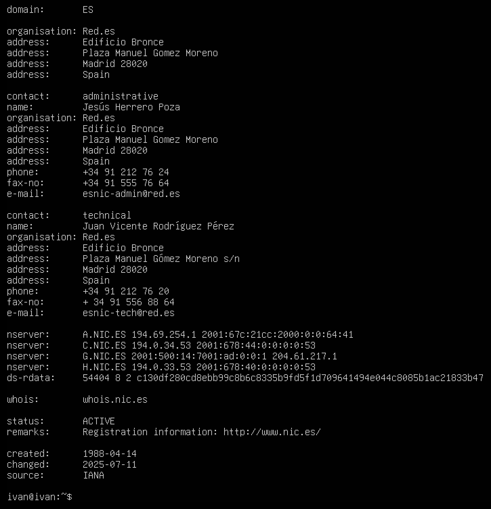

# backup with rsync and tar.gz

<h2 align="center">Copias de seguridad</h2>

## Introducción

En esta práctica exploramos de forma práctica cómo crear y automatizar copias de seguridad en Linux utilizando tar.gz y rsync.

Trabajamos tanto en una sola máquina virtual como entre dos diferentes, configurando la transferencia de datos de manera segura mediante SSH.

Además, desarrollamos un script personalizado que genera copias con la fecha en el nombre, una idea que surgió tras ver un video sobre automatización que nos resultó muy útil.

## ¿Qué son las copias de seguridad?

Las copias de seguridad (también llamadas backups) son duplicados de información importante como documentos, fotografías, bases de datos o configuraciones del sistema que se guardan en un lugar distinto al original.\
La idea es simple pero poderosa: si algo le ocurre al dispositivo principal como un ordenador, móvil o servidor, podamos recuperar la información desde otra ubicación.

De esta manera, reducimos drásticamente el riesgo de pérdida total de datos en caso de fallos de hardware, ciberataques, robos o incluso desastres naturales.

## ¿Por qué debemos hacer copias de seguridad?

Podríamos decir que las copias de seguridad son una especie de “seguro de vida” para nuestros datos.\
Entre las principales razones para realizarlas están:

* Errores humanos: cualquiera puede borrar o modificar un archivo importante por accidente. Con un backup, se puede recuperar fácilmente.
* Fallos técnicos: los discos duros o sistemas pueden averiarse de forma repentina.
* Ataques cibernéticos: virus, ransomware o malware pueden bloquear o cifrar los archivos. Tener una copia evita pagar rescates.\
  Robo o pérdida de equipos: si se extravía un portátil o un USB, la información seguirá disponible en la copia.
* Desastres naturales: incendios, inundaciones o terremotos pueden destruir equipos, pero no afectarán a copias guardadas en la nube o en otro lugar.
* Errores de software: actualizaciones fallidas pueden corromper datos. Si hay copia, la restauración es rápida.

## Clasificación de la información (Modelo CIA)

Antes de decidir qué información proteger y cómo hacerlo, se utiliza un modelo muy conocido: el Modelo CIA, que representa tres principios básicos:

* Confidencialidad: solo las personas autorizadas deben tener acceso a los datos.
* Integridad: los datos deben mantenerse correctos y sin modificaciones indebidas.
* Disponibilidad: la información debe estar accesible siempre que se necesite.

En resumen, cuanto más sensible o valiosa sea la información, mayor debe ser el nivel de protección y redundancia aplicado.

## Duración de una copia de seguridad completa

El tiempo que toma una copia completa depende de varios factores: la cantidad de datos, los recursos del sistema y el tipo de copia empleada.\
En las empresas es común realizar una copia completa semanal por ejemplo, los domingos y durante la semana hacer copias incrementales o diferenciales, que son más rápidas y ocupan menos espacio.

Respecto al tiempo de retención, normalmente se conservan entre 1 y 3 meses, ya que mantenerlas indefinidamente puede resultar costoso y requerir gran capacidad de almacenamiento.

## Tipos de discos para respaldos

Existen diferentes tipos de discos que pueden emplearse para realizar copias de seguridad:

* Discos duros HDD (mecánicos): ofrecen gran capacidad a bajo costo. Ideales para almacenar grandes volúmenes de información.\
  \

* Discos SSD (estado sólido): más rápidos y resistentes, ya que no tienen partes móviles. Recomendados para copias frecuentes.
* NAS (Network Attached Storage): sistemas de almacenamiento en red que permiten acceder a las copias desde distintos dispositivos. Se pueden configurar en RAID y automatizar copias.
* Discos híbridos (SSHD): combinan la tecnología de HDD y SSD, logrando un equilibrio entre velocidad y capacidad.

## ¿Influyen en el tiempo de respaldo?

Sí, el tipo de disco influye notablemente.\
Los SSD son los más rápidos, mientras que los HDD son más lentos debido a su naturaleza mecánica.\
En sistemas NAS, la velocidad depende tanto del tipo de disco interno como de la red a la que estén conectados.

## ¿Cuándo se hacen los respaldos y restauraciones?

En la mayoría de organizaciones, las copias se ejecutan durante horarios de baja actividad, generalmente por la noche o los fines de semana, para evitar interferir con las operaciones diarias.\
Las restauraciones se realizan ante fallos del sistema, pérdida de datos o cuando se necesita recuperar versiones anteriores de archivos o bases de datos.

## Copias Incrementales vs Diferenciales

* Copia incremental: guarda únicamente los archivos nuevos o modificados desde la última copia ya sea completa o incremental. Es más rápida y ocupa menos espacio, pero requiere todas las copias previas para restaurar.
* Copia diferencial: almacena los cambios desde la última copia completa. Ocupa más espacio, pero es más sencilla de restaurar, ya que solo se necesita la copia completa inicial y la última diferencial.

Ejemplo:\
Si el lunes haces una copia completa y el martes cambias tres archivos, la incremental del miércoles sólo copiará los nuevos, mientras que la diferencial guardará todos los cambios desde el lunes.

## ¿Dónde almacenar las copias de seguridad?

Las copias deben almacenarse en un lugar distinto al equipo original. Algunas opciones comunes son:

* Memorias USB o discos externos: económicas y portátiles.
* Servidor interno de la empresa: permite automatizar y cifrar copias, aunque depende de la conexión interna.
* Servidor externo dedicado: más seguro, ya que está fuera del entorno principal, pero con mayor coste.
* Almacenamiento en la nube (Cloud): accesible desde cualquier lugar, flexible y con alta disponibilidad.

## Estrategia 3-2-1

Esta estrategia es una de las más recomendadas y consiste en:

* Tener 3 copias de los datos 1 original + 2 copias de respaldo.
* Guardarlas en 2 medios diferentes por ejemplo, un disco externo y la nube.
* Mantener 1 copia fuera del lugar físico por ejemplo, en otro edificio o servidor remoto.

## Cifrado de copias de seguridad

El cifrado es clave para proteger nuestras copias de seguridad, ya que impide que personas no autorizadas accedan a datos si el dispositivo cae en manos equivocadas, si se pierde o es robado. Existen dos tipos principales:&#x20;

* Simétrico: usa la misma clave para cifrar y descifrar (más rápido, pero menos seguro si la clave se comparte).
* Asimétrico: usa una clave pública y otra privada, ofreciendo mayor seguridad.

\

Entre las herramientas más utilizadas están:

* BitLocker (Windows): integrada en Windows Pro y Enterprise. Permite cifrar discos completos, protegiendo los datos con contraseña o chip TPM.
* FileVault (macOS): cifra todo el contenido del disco, protegiendo el acceso al sistema y los archivos personales.
* VeraCrypt: gratuita y multiplataforma. Permite crear volúmenes cifrados o cifrar discos completos. Muy usada por su facilidad y alta seguridad.

## Copias en la nube: consideraciones

Al hacer copias de seguridad en la nube, es importante:

* Proveedor confiable: asegúrate de elegir uno con buena reputación y soporte técnico disponible.
* Cifrado de datos: protege tus copias con cifrado fuerte, tanto al guardarlas como al transferirlas.
* Cumplimiento legal: verifica que cumpla con normas como el RGPD u otras leyes de protección de datos.
* Ubicación de los servidores: comprueba en qué país están los centros de datos, ya que las leyes pueden variar.
* Frecuencia y retención: define cada cuánto se harán las copias y cuánto tiempo se conservarán.
* Tipo de nube: elige entre pública (más barata), privada (más segura) o híbrida (equilibrada).
* Restauración rápida: confirma que puedas recuperar los datos fácilmente ante cualquier pérdida.
* Coste y capacidad: revisa los precios y asegúrate de tener espacio suficiente para todas tus copias.

\
SAN (Storage Area Network)
--------------------------

Una SAN (Storage Area Network) es una red dedicada de almacenamiento que conecta varios servidores y dispositivos para compartir datos con alta velocidad, seguridad y disponibilidad. Es ideal para empresas grandes porque mejora el rendimiento, facilita la gestión centralizada y permite recuperar datos ante fallos o desastres.

Ventajas principales:

Alta disponibilidad: los datos están accesibles por múltiples rutas.

Mejor rendimiento: descarga el trabajo de los servidores.

Gestión centralizada: más fácil de controlar y escalar.

Recuperación ante desastres: permite guardar copias en ubicaciones remotas.

## NAS (Network Attached Storage)

Un NAS (Network Attached Storage) es un dispositivo de almacenamiento conectado a la red que actúa como nube privada en casa o la oficina. Es un pequeño ordenador (con CPU, RAM y su propio sistema operativo) pensado para estar encendido todo el día y guardar, compartir y hacer copias de seguridad de archivos desde varios equipos y móviles. Además de almacenar, muchos NAS permiten apps: servidor multimedia (Plex), descargas, servidor web/FTP, cuentas de usuarios, incluso VPN.

Ejemplos de pago:

* Synology DiskStation
* QNAP Turbo NAS
* Western Digital My Cloud

Ejemplos libres o de código abierto:

* TrueNAS CORE (antes FreeNAS)
* OpenMediaVault

## Parte práctica: Proceso desarrollado con tar.gz y rsync

En la parte práctica del trabajo realizamos diferentes ejercicios para entender cómo funcionan las copias de seguridad tanto en una sola máquina virtual (MV) como entre dos máquinas virtuales distintas (una de origen y otra de destino).\
Para esto utilizamos dos herramientas fundamentales en entornos Linux: tar.gz y rsync, las cuales nos permitieron comparar métodos, ventajas y tiempos de ejecución.

### 1. En una misma máquina virtual

En este primer escenario, trabajamos únicamente dentro de una sola máquina virtual, lo que nos permitió observar el comportamiento de las copias locales.\
Utilizamos dos herramientas de respaldo complementarias:

**a) Creación y restauración con tar.gz**

Con tar.gz realizamos copias de seguridad completas, incrementales y diferenciales sobre una carpeta de contenidos previamente seleccionada.\
El comando tar nos permitió empaquetar todos los archivos en un único fichero comprimido con formato .tar.gz, lo cual facilita su almacenamiento y transporte.

* Copia completa:\
  Primero generamos una copia completa de toda la carpeta utilizando el siguiente comando:

tar -czvf copia\_completa.tar.gz /ruta/de/la/carpeta

\

Este comando crea un archivo comprimido que contiene todos los datos de la carpeta original.

* Copia incremental:\
  Posteriormente, creamos copias incrementales empleando el parámetro --listed-incremental junto con un archivo .snar, que guarda el registro de los cambios entre una copia y otra. Por ejemplo:


tar --listed-incremental=backup.snar -czvf copia\_incremental.tar.gz /ruta/de/la/carpeta


El archivo .snar (snapshot archive) actúa como una especie de historial. Cada vez que se ejecuta una copia incremental, tar compara el estado actual con el anterior y solo guarda los archivos nuevos o modificados, evitando duplicar la información.

* Copia diferencial:\
  De manera similar, también hicimos una copia diferencial. La diferencia es que esta guarda todos los cambios desde la última copia completa, sin importar si ya hubo incrementales en medio. El comando es muy parecido:


tar --listed-incremental=backup.snar -czvf copia\_diferencial.tar.gz /ruta/de/la/carpeta


Pero, en este caso, antes de generarla, se elimina o modifica el archivo .snar para que tar solo se compare con la copia completa inicial.

## 2. En dos máquinas virtuales (origen y destino)

En el segundo escenario configuramos dos máquinas virtuales:

* MV1 (Origen): contenía la carpeta con los archivos originales.
* MV2 (Destino): recibiría las copias de seguridad a través de la red.

Para este ejercicio utilizamos rsync combinado con SSH, de modo que la transferencia se hiciera de forma segura y cifrada.\
El comando empleado fue:

rsync -avz -e ssh usuario@IP\_destino:/ruta/origen/ /ruta/destino/

Antes de ejecutarlo, configuramos las claves SSH para que la conexión no pidiera contraseña en cada ejecución, lo que permitió automatizar el proceso fácilmente con crontab.

3\. Elección de herramienta para un script automatizado

Si tuviéramos que desarrollar un script de copias de seguridad automáticas, la mejor opción sería rsync.\
Las razones son claras:

* Permite realizar copias incrementales automáticas, transfiriendo solo los archivos modificados.
* Se integra fácilmente con crontab para ejecutar tareas programadas sin intervención manual.
* Usa SSH para garantizar la seguridad de la transferencia.
* No genera archivos comprimidos cada vez, por lo que ahorra tiempo y espacio.

Por ejemplo, un script sencillo podría ser:

\#!/bin/bash

FECHA=$(date +%Y-%m-%d)

rsync -avz --delete -e ssh /ruta/origen/ usuario@IP\_destino:/backups/$FECHA/

Este script genera una carpeta de respaldo con la fecha actual y sincroniza solo los cambios, eliminando archivos que ya no existen en el origen.

En cambio, tar.gz es más adecuado para respaldo archivado o histórico, como copias semanales o mensuales, donde interesa conservar un paquete comprimido que pueda almacenarse o enviarse a largo plazo.\
Sin embargo, su desventaja es el mayor consumo de recursos y el tiempo necesario para comprimir y descomprimir en cada ejecución.

Sin embargo, su principal desventaja es que cada ejecución requiere empaquetar y comprimir los datos nuevamente, lo que consume más tiempo y recursos, especialmente si las copias son frecuentes.

En un entorno con máquinas virtuales conectadas por red, donde los datos no son excesivos y se busca automatización y eficiencia, rsync es la herramienta más adecuada.

\

<h2 align="center">rsync</h2>

### Qué es rsync

rsync (remote sync) es una herramienta muy utilizada en sistemas Linux para sincronizar archivos y directorios, tanto localmente como entre equipos diferentes.\
Su nombre proviene de “remote synchronization”, y su principal característica es que solo transfiere los archivos nuevos o modificados, lo cual ahorra tiempo y ancho de banda.

Entre sus principales características destacan:

* Permite sincronización en ambos sentidos (origen ↔ destino).
* Mantiene permisos, fechas, y estructura de carpetas.
* Usa algoritmos de comparación binaria para detectar cambios exactos en los archivos.
* Integra cifrado SSH, garantizando transferencias seguras.
* Puede ejecutarse automáticamente mediante tareas programadas (cron jobs).
* Es multiplataforma y muy eficiente incluso con grandes volúmenes de datos.

Por todo esto, rsync se ha convertido en una herramienta estándar para administradores de sistemas, técnicos de respaldo y entornos virtualizados, tanto en el ámbito empresarial como académico.\

### Opciones de rsync más importantes&#x20;

| comando                      | significado                                        | para qué sirve                                                                                                                                                                     |
| ---------------------------- | -------------------------------------------------- | ---------------------------------------------------------------------------------------------------------------------------------------------------------------------------------- |
| rsync                        | 
remote sync

sincronización remota
     | Permite copiar o sincronizar archivos entre diferentes ubicaciones, ya sea dentro del mismo sistema o entre equipos conectados por red.                                            |
| -a                           | 
archive

modo archivo
                  | copia los archivos de forma recursiva, manteniendo permisos, propietarios, fechas y estructura de carpetas.                                                                        |
| -v                           | verbose                                            | Muestra en pantalla qué archivos se están copiando o sincronizando, lo cual permite seguir el proceso en tiempo real.                                                              |
| -z                           | zip // compress                                    | Comprime los datos mientras se envían, haciendo la transferencia más rápida y eficiente, especialmente útil cuando se trabaja por red.                                             |
| -h                           | 
human-readable

legible formato humano
 | Presenta los tamaños de los archivos en un formato fácil de entender.                                                                                                              |
| –progress                    | progreso                                           | Permite visualizar el avance del proceso, mostrando el porcentaje completado y la velocidad de transferencia.                                                                      |
| –delete                      | Eliminar                                           | Borra en el destino aquellos archivos que ya no existen en el origen, asegurando que ambos directorios queden exactamente iguales.                                                 |
| –dry-run                     | 
 
                                        | 
Realiza una prueba sin hacer cambios reales. Muestra qué archivos se copiaron o eliminaron, ideal para comprobar el comando antes de ejecutarlo definitivamente.

 
 |
| –exclude=”carpeta”           | excluir archivo                                    | Evita que ciertos archivos o directorios sean copiados o sincronizados, lo cual es útil para omitir datos innecesarios (por ejemplo, node\_modules).                               |
| –include=”carpeta”           | incluir archivo                                    | Obliga a rsync a incluir determinados archivos o carpetas que normalmente serían excluidos por otros patrones.                                                                     |
| -e ssh                       | 
 
                                        | Indica que la transferencia se hará a través de una conexión SSH, garantizando seguridad y cifrado durante la sincronización.                                                      |
| /origen/                     | ruta de origen                                     | Es la carpeta o ubicación desde la que se copian los archivos. Si lleva una barra final /, rsync copiará solo su contenido, no la carpeta en sí.                                   |
| userdestino@ip>destino:ruta/ | ruta de destino                                    | Indica la ubicación donde se guardarán los archivos sincronizados. Se puede usar una dirección IP y un usuario remoto para transferir entre equipos distintos.                     |

### Contexto en que se puede utilizar

Rsync es una herramienta esencial para realizar copias de seguridad eficientes y seguras, ya que sólo transfiere los archivos modificados, optimizando tiempo y recursos. Se utiliza ampliamente en entornos de desarrollo, producción y educativos para mantener sincronizados proyectos, servidores o máquinas virtuales.

Gracias a opciones como -a (modo archivo), -z (compresión), --progress (seguimiento del avance) y --delete (sincronización exacta), rsync garantiza backups actualizados y completos. Además, al integrarse con tareas programadas mediante cron, permite automatizar el proceso, creando copias incrementales o totales sin intervención manual.

## [TAR.GZ](http://tar.gz/)

### Qué es el [tar.gz](http://tar.gz/)

El formato tar.gz combina en un solo proceso las funciones de dos herramientas: tar, que agrupa varios archivos o carpetas en un único paquete manteniendo su estructura interna, y gzip, que comprime ese paquete para reducir su tamaño. El resultado es un archivo único, compacto y fácil de manejar, con la extensión [tar.gz](http://tar.gz/).

Este formato es ampliamente utilizado para crear copias de seguridad completas y organizadas, ya que permite almacenar grandes volúmenes de información sin perder la jerarquía original de los directorios. Gracias a la compresión, también facilita el ahorro de espacio y la transferencia rápida de datos entre sistemas, lo que lo convierte en una herramienta esencial tanto para administradores de sistemas como para estudiantes y profesionales que necesitan realizar backups periódicos.

Además, tar.gz admite muchas opciones que amplían sus posibilidades, como la visualización del contenido del archivo, la exclusión de carpetas específicas durante la copia o la creación de copias incrementales y diferenciales mediante archivos de estado. En conjunto, estas características hacen de tar.gz una solución práctica, versátil y confiable para la gestión y protección de información en entornos locales o remotos.

### Utilidad del tar.gz para crear copias de seguridad incrementales y diferenciales&#x20;

Cuando se utiliza tar.gz para crear copias de seguridad incrementales y diferenciales, se emplea la opción **--listed-incremental** seguida de un archivo de control (por ejemplo, backup.snar).

Ese archivo .snar guarda una “foto” del estado de los archivos en el momento del respaldo.

Cada vez que se ejecuta el comando, tar compara el sistema actual con la información guardada en ese archivo, y así determina qué debe incluir en la nueva copia.

Aquí se genera la copia completa inicial. El archivo backup.snar no existía antes, por lo tanto tar incluye todos los archivos de la carpeta origin. Además, crea el archivo .snar, que servirá como referencia para los próximos respaldos. En este momento, el sistema hace una foto completa del estado de los archivos.

.png>)

Aquí se crea una copia incremental. Se utiliza el mismo archivo backup.snar, que ya contiene información del respaldo anterior. Tar compara la carpeta origin con lo registrado en el .snar y solo guarda los archivos nuevos o modificados. Después de ejecutar, el .snar se actualiza con el nuevo estado.  Esto permite ahorrar espacio, ya que solo se incluyen los cambios recientes.

.png>)

Primero se crea una copia del archivo .snar original. Esa copia (backup-base.snar) no se modifica y servirá para generar copias diferenciales. Luego se ejecuta tar usando esa copia fija, por lo que el sistema compara siempre con la copia completa inicial. Así, esta copia diferencial incluye todos los cambios realizados desde la copia completa, sin depender de las incrementales.  Con cada nueva diferencial, se vuelven a incluir todos los archivos que cambiaron desde el primer respaldo completo.

.png>)

Aquí se muestran todos los archivos generados:

* backup-full.tar.gz: copia completa
* backup-incr.tar.gz: copia incremental
* backup-diff.tar.gz: copia diferencial
* backup.snar: registro usado por las completas e incrementales
* backup-base.snar: registro fijo usado por las diferenciales

\
Copia por la red a un equipo remoto con RSYNC.&#x20;
----------------------------------------------------

<h3 align="center">Ejemplos de uso entre dos MV diferentes.</h3>

### capturas de la rsync

1\.

.png>)

Este comando realiza una copia remota de la carpeta origin hacia la máquina destino usando rsync.

Las opciones (-a, -v, -z, -h) garantizan que la copia sea completa, comprimida, detallada y legible.

**-e ssh** asegura que todo el proceso sea seguro, ya que viaja cifrado por SSH. En este punto, la máquina establece conexión con la otra y transfiere los archivos conservando permisos y estructura.

2\.

.png>)

Aquí se muestra el resultado de la sincronización.

Rsync indica qué archivos fueron copiados y resume la transferencia.  La máquina origen compara los datos con el destino y solo envía lo necesario, optimizando tiempo y red.

3\.

.png>)

Comprobación desde la máquina destino.

El comando ls confirma que los archivos llegaron correctamente a la carpeta de destino.

Ver el contenido validó que la copia remota se completó con éxito.

### capturas del tar.gz

1\.

.png>)

Este comando envía el archivo comprimido de respaldo (backup-full.tar.gz) a otra máquina mediante SCP. El uso de SSH protege la transmisión, garantizando una copia segura en el servidor remoto.

2\.

.png>)

Se verifica en la máquina destino que el archivo de respaldo fue recibido correctamente.  Esto confirma que la transferencia se realizó sin errores y el backup está disponible.

3\.

.png>)

El error indica que tar intentó extraer archivos que ya existían.  Para evitarlo, se debe descomprimir en una carpeta vacía.

4\.

.png>)

Aquí se crea una carpeta nueva (restaurada) y se extrae el backup de forma segura.  Así se recuperan los datos sin sobrescribir los existentes, garantizando una restauración limpia.

Para la tarea de crontab he mirado un video muy interesante: 

[https://youtu.be/ElEw7cA2Ea8?si=R\_kOkOqJ2Dm0BglI](https://youtu.be/ElEw7cA2Ea8?si=R_kOkOqJ2Dm0BglI)

.png>)

Este script sirve para automatizar las copias de seguridad entre máquinas, y añadí la parte de las fechas porque vi un video hace unas dos semanas y me pareció muy interesante cómo se podían generar backups con la fecha exacta en el nombre.\
Primero definí las variables con las rutas, la fecha, el nombre del archivo y los datos del servidor remoto.\
Luego el script crea una carpeta local con la fecha actual, comprime los archivos con tar y verifica si se creó correctamente.\
Después usa rsync con SSH para enviar el backup al servidor remoto y comprueba si la transferencia ha sido exitosa.\
Finalmente, muestra la hora en que terminó el proceso, dejando un registro del momento exacto del backup.

.png>)

Damos permisos de ejecución al script backup\_remote.sh, permitiendo que se pueda ejecutar directamente como un comando.

.png>)

Ejecutamos el script de backup.

Dentro del script probablemente se crea un archivo comprimido (.tar.gz) con la fecha y hora actual.

.png>)

Abrimos el editor del crontab del usuario actual (camilly) para programar tareas automáticas.

.png>)

Esta línea se escribe dentro del crontab.

Le indica al sistema que ejecute el script backup\_remote.sh todos los días a las 19:00.

.png>)

Ejecutamos el script manualmente. El script crea una copia comprimida (.tar.gz) de los archivos locales y la guarda con la fecha y hora en el nombre.

.png>)

Mensaje del script indicando que el backup local se generó exitosamente.

.png>)

He tenido que utilizar el comando ssh-keygen -t rsa porque cada vez que el script backup\_remote.sh se ejecutaba, me pedía la contraseña del servidor remoto (camilly@192.168.6.4).

Esto impedía automatizar el backup con cron, ya que cron no puede introducir contraseñas.

Al generar una clave SSH y copiarla al servidor, puedo conectar sin contraseña y permitir que el proceso se ejecute automáticamente.

\

.png>)

Ejecutamos ssh-copy-id camilly@192.168.6.4 para copiar la clave pública generada al archivo authorized keys del usuario en el servidor remoto.\
El sistema pidió la contraseña una última vez para poder copiarla, y después mostró el mensaje “Number of key(s) added: 1”, indicando que la conexión sin contraseña ya estaba configurada correctamente.

.png>)

Hemos comprobado con el comando ls en la carpeta de destino que los archivos de copia (.tar.gz) se habían transferido correctamente al servidor remoto.

\

## Enlaces de referencias para dar las respuestas a lo preguntado:

[https://punkymo.gitbook.io/miwiki/seguridad/backups](https://punkymo.gitbook.io/miwiki/seguridad/backups)

[https://punkymo.gitbook.io/miwiki/seguridad/backups/rsync/ejemplo-de-rsync](https://punkymo.gitbook.io/miwiki/seguridad/backups/rsync/ejemplo-de-rsync)

[https://www.ticportal.es/glosario-tic/copia-seguridad-backup](https://www.ticportal.es/glosario-tic/copia-seguridad-backup)

[https://www.kaspersky.com/resource-center/preemptive-safety/backup-files](https://www.kaspersky.com/resource-center/preemptive-safety/backup-files)

[https://itsecurity.uiowa.edu/it-policies/it-guidelines/data-classification-guidelines#:\~:text=The%20criteria%20are%20Confidentiality%2C%20Integrity,to%20access%20an%20information%20asset](https://itsecurity.uiowa.edu/it-policies/it-guidelines/data-classification-guidelines).

[https://www.xataka.com/seleccion/guia-compra-para-hacer-copias-seguridad-discos-duros-nas-memorias-usb-para-backups-tus-dispositivos](https://www.xataka.com/seleccion/guia-compra-para-hacer-copias-seguridad-discos-duros-nas-memorias-usb-para-backups-tus-dispositivos)

[https://www.acronis.com/es/blog/posts/incremental-differential-backups/](https://www.acronis.com/es/blog/posts/incremental-differential-backups/)

[https://help.gnome.org/users/gnome-help/stable/backup-where.html.es](https://help.gnome.org/users/gnome-help/stable/backup-where.html.es)

[https://www.gadae.com/blog/donde-almacenar-tus-copias-de-seguridad/](https://www.gadae.com/blog/donde-almacenar-tus-copias-de-seguridad/)

[https://www.youtube.com/watch?v=FheYEyLVj1Y](https://www.youtube.com/watch?v=FheYEyLVj1Y)

[https://www.acronis.com/es/blog/posts/managed-cloud-backup/](https://www.acronis.com/es/blog/posts/managed-cloud-backup/)

[https://www.ibm.com/es-es/think/topics/storage-area-network](https://www.ibm.com/es-es/think/topics/storage-area-network)

[https://www.xataka.com/basics/servidores-nas-que-como-funcionan-que-puedes-hacer-uno](https://www.xataka.com/basics/servidores-nas-que-como-funcionan-que-puedes-hacer-uno)

[https://www.digitalocean.com/community/tutorials/how-to-use-rsync-to-sync-local-and-remote-directories-es](https://www.digitalocean.com/community/tutorials/how-to-use-rsync-to-sync-local-and-remote-directories-es)

[https://punkymo.gitbook.io/miwiki/seguridad/backups/rsync](https://punkymo.gitbook.io/miwiki/seguridad/backups/rsync)

[https://www.youtube.com/watch?v=t18-C6f9y5Q](https://www.youtube.com/watch?v=t18-C6f9y5Q)

[https://www.youtube.com/watch?v=Gr5-WpjmM3A](https://www.youtube.com/watch?v=Gr5-WpjmM3A)

\
\
\
\
\
\
\
