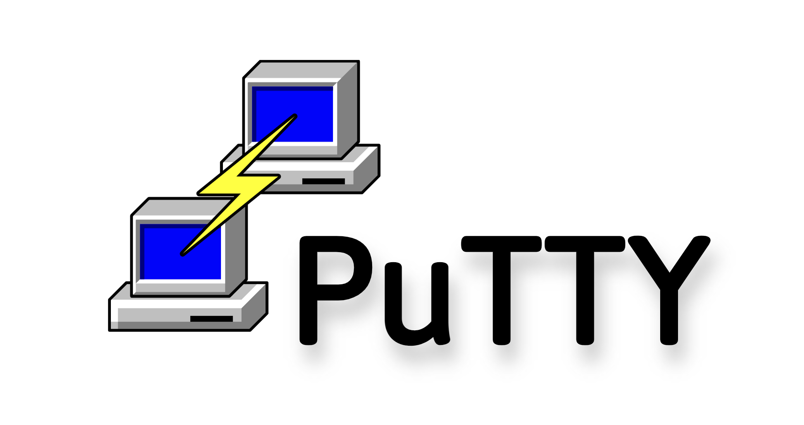

# Linux remote access options

**PuTTY**: is a small Windows program that opens a secure, text‑based window on a remote computer—usually a Linux server—using the SSH protocol.&#x20;

What's the use of it?

* Run commands on a remote server (update software, check logs).
* **Use a serial console** to configure network gear.

To install just go to their official webpage [https://www.chiark.greenend.org.uk/\~sgtatham/putty/latest.html](https://www.chiark.greenend.org.uk/~sgtatham/putty/latest.html)

<figure><figcaption></figcaption></figure>

**SSH for Windows 10/11 and for MacOS:**

Windows has a built‑in OpenSSH client since the April 2018 update, and MacOS has a built‑in OpenSSH in Terminal.app.

Command to access your Linux machine:


ssh -l username IP address&#x20;


So basically:


ssh -l camilly 192.168.1.1


Then you'll enter your password and boom, you're inside.
