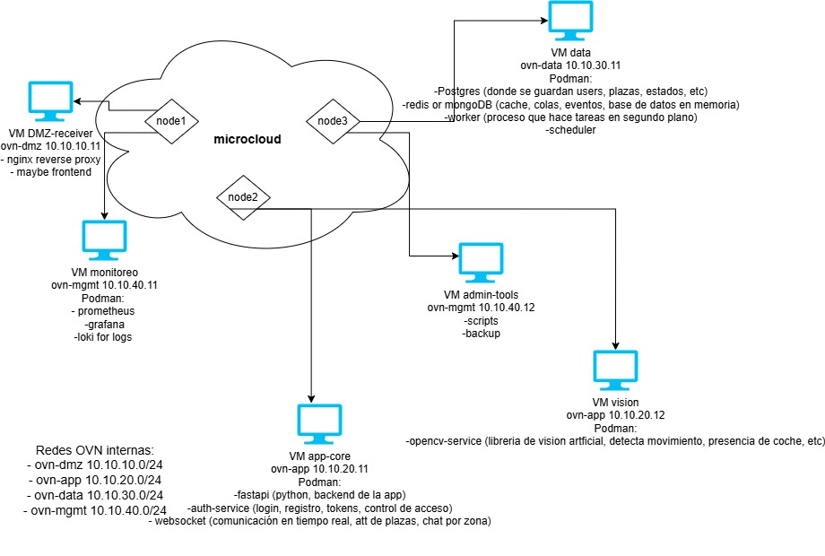
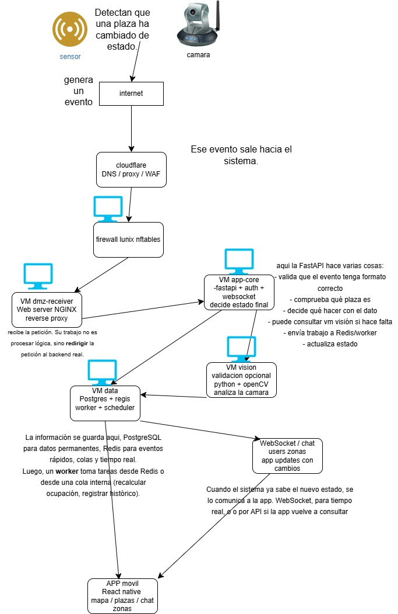

# Proyeto

## Plataforma segura de aparcamiento inteligente basada en MicroCloud

### 1. Introducción

El proyecto consiste en el desarrollo de una plataforma inteligente capaz de mostrar en tiempo real el estado de las plazas de aparcamiento en la vía pública. La solución combina sensores IoT, cámaras para validación visual, una infraestructura cloud privada y una aplicación móvil que permite a los usuarios conocer si una plaza está libre antes de llegar.

La motivación principal del sistema es reducir el tiempo que los conductores pasan buscando aparcamiento, disminuir el tráfico innecesario en las ciudades y mejorar la gestión de los espacios de estacionamiento.

El sistema está diseñado pensando en ciudades como Barcelona, donde existen distintos tipos de zonas de aparcamiento regulado, cada una con reglas específicas.

***

## 2. Contexto del aparcamiento en Barcelona

En Barcelona el aparcamiento en la vía pública se organiza en diferentes tipos de zonas:

Zona blanca\
Son plazas gratuitas sin limitación de pago, aunque pueden tener limitaciones horarias en algunas áreas.

Zona verde\
Están pensadas principalmente para residentes. Los residentes pueden estacionar a un precio reducido, mientras que los no residentes pagan una tarifa mayor y normalmente solo pueden aparcar durante un tiempo limitado.

Zona azul\
Son plazas de pago para rotación de vehículos. Permiten estacionar durante un periodo máximo determinado y requieren el pago correspondiente.

El sistema propuesto busca ayudar a los usuarios a saber si una plaza está disponible antes de llegar, independientemente del tipo de zona. La aplicación también puede mostrar el tipo de plaza, su estado y las restricciones asociadas.

***

## 3. Objetivo principal del sistema

El objetivo del sistema es responder a una pregunta simple pero muy útil para el conductor:

“¿Hay una plaza disponible en esta zona ahora mismo?”

Para lograrlo, el sistema combina tres fuentes de información:

Sensores instalados en las plazas\
Detectan si un vehículo está presente o no.

Cámaras de validación\
Analizan visualmente la zona para confirmar la ocupación.

Aplicación móvil\
Muestra la información en tiempo real al usuario.

La combinación de sensores y cámaras mejora la fiabilidad de los datos, ya que permite detectar inconsistencias o errores en la lectura de los sensores.

***

## 4. Demostración mediante maqueta

Para la demostración del proyecto se utilizará una maqueta física que representa una calle con varias plazas de aparcamiento.

En la maqueta habrá:

Pequeñas plazas simuladas\
Sensores que detectan la presencia de un vehículo\
Una cámara que observa la zona\
Una aplicación que muestra el estado de las plazas

Cuando se coloque un coche en una plaza de la maqueta:

1. El sensor detectará la presencia del vehículo.
2. La cámara confirmará visualmente la ocupación.
3. El backend actualizará el estado de la plaza.
4. La aplicación mostrará la plaza como ocupada.

Esto permite demostrar el funcionamiento completo del sistema en tiempo real.

***

## 5. Arquitectura general del sistema

La arquitectura del sistema se organiza en varias capas:

Capa pública\
Gestiona el acceso desde Internet.

Capa de infraestructura\
Proporciona la plataforma cloud privada.

Capa de máquinas virtuales\
Separa las funciones del sistema.

Capa de servicios\
Ejecuta los servicios de aplicación.

Cada capa tiene una función específica y ayuda a mantener el sistema organizado y seguro.

<figure><figcaption></figcaption></figure>

## 6. Infraestructura cloud privada

El núcleo del sistema es un clúster MicroCloud formado por tres nodos Ubuntu Server.

MicroCloud es una plataforma ligera de cloud privada desarrollada por Canonical. Permite crear un pequeño entorno cloud dentro de una infraestructura local utilizando varios servidores.

MicroCloud integra tres componentes principales:

LXD\
Sistema de virtualización que permite crear máquinas virtuales o contenedores.

MicroOVN\
Sistema de red virtual que permite crear redes internas entre las máquinas virtuales.

MicroCeph\
Sistema de almacenamiento distribuido que replica los discos entre nodos para mejorar la resiliencia.

Este modelo permite construir una infraestructura similar a una nube pública, pero dentro de un entorno controlado.

***

## 7. Por qué se eligió MicroCloud en lugar de Proxmox

Proxmox es una plataforma de virtualización muy utilizada, pero está orientada principalmente a la gestión clásica de máquinas virtuales.

MicroCloud se eligió porque ofrece:

Integración directa con Ubuntu Server\
Despliegue sencillo de clústeres\
Red virtual avanzada con OVN\
Integración con almacenamiento distribuido\
Arquitectura más cercana a modelos cloud modernos

Esto permite construir una arquitectura que se asemeja más a infraestructuras utilizadas en entornos cloud profesionales.

***

## 8. Organización de los nodos

El sistema utiliza tres nodos dentro del clúster.

Cada nodo ejecuta Ubuntu Server y forma parte del clúster MicroCloud.

Ejemplo de direcciones:

Node1\
LAN: 192.168.20.11\
MGMT: 192.168.30.11

Node2\
LAN: 192.168.20.12\
MGMT: 192.168.30.12

Node3\
LAN: 192.168.20.13\
MGMT: 192.168.30.13

Cada nodo puede ejecutar diferentes máquinas virtuales del sistema.

## 9. Máquinas virtuales del sistema

El sistema se divide en varias máquinas virtuales, cada una con una función específica.

DMZ-Ingress\
Recibe tráfico desde Internet y lo redirige al backend.

App-Core\
Contiene la lógica principal del sistema.

Data\
Contiene la base de datos y servicios de datos.

Vision\
Procesa imágenes de cámaras con OpenCV.

Monitoring\
Monitoriza el estado del sistema.

Admin-Tools\
Herramientas de administración y backup.

En los diagramas cada VM aparece asociada a un nodo, pero en realidad el clúster puede arrancar las máquinas virtuales en cualquier nodo disponible dependiendo de la carga del sistema.

<figure><figcaption></figcaption></figure>

## 10. Servidores y servicios necesarios

Dentro de las máquinas virtuales se ejecutan varios servicios.

Nginx o Caddy\
Servidor web que actúa como reverse proxy y punto de entrada HTTP/HTTPS.

FastAPI\
Framework de Python que implementa el backend del sistema y expone la API.

Auth Service\
Servicio encargado de autenticación de usuarios y gestión de tokens.

WebSocket Service\
Servicio que permite comunicación en tiempo real con la aplicación móvil.

PostgreSQL\
Base de datos principal donde se almacenan usuarios, plazas y eventos.

Redis\
Base de datos en memoria utilizada para cache, colas y comunicación entre servicios.

Workers\
Procesos que ejecutan tareas en segundo plano sin bloquear el backend.

OpenCV Service\
Servicio que analiza imágenes de cámaras para detectar vehículos.

Prometheus\
Sistema que recopila métricas del sistema.

Grafana\
Interfaz visual para monitorizar el estado del sistema.

***

## 11. Uso de contenedores Podman

Dentro de cada máquina virtual los servicios se ejecutan en contenedores Podman.

Podman es un motor de contenedores similar a Docker, pero diseñado para funcionar sin un proceso central permanente.

El modelo de ejecución es:

Servidor físico\
-> Máquina virtual LXD\
-> Contenedores Podman

Esto permite aislar los servicios y facilitar su gestión.

***

## 12. Redes del sistema

El sistema utiliza varias redes para separar funciones.

WAN\
Conexión a Internet.

DMZ\
Zona donde se publica el punto de entrada del sistema.

LAN\
Red interna de infraestructura.

MGMT\
Red dedicada a administración.

VPN\
Red del túnel WireGuard.

Ejemplo de direccionamiento:

DMZ\
192.168.10.0/24

LAN\
192.168.20.0/24

MGMT\
192.168.30.0/24

VPN\
10.99.0.0/24

***

## 13. Conexión VPN y red de administración

La administración del sistema no se realiza directamente desde Internet.

Primero el administrador se conecta a la VPN mediante WireGuard.

Una vez conectado, el portátil obtiene una dirección en la red VPN.

Ejemplo:

Portátil administrador\
10.99.0.10

El firewall conecta la red VPN con la red MGMT.

Desde esa red el administrador puede acceder por SSH a los nodos del clúster.

El flujo es:

Portátil\
\- VPN WireGuard\
\- firewall\
\- red MGMT\
\- nodos del clúster

Esto evita exponer servicios administrativos al exterior.

***

## 14. Redes virtuales internas (OVN)

Dentro del clúster se utilizan redes OVN para separar servicios.

OVN es un sistema de redes virtuales que permite crear subredes internas entre máquinas virtuales.

Las redes utilizadas son:

ovn-dmz\
Para la máquina virtual de entrada pública.

ovn-app\
Para los servicios de aplicación.

ovn-data\
Para la base de datos.

ovn-mgmt\
Para servicios de administración y monitorización.

La segmentación permite controlar mejor qué servicios pueden comunicarse entre sí y mejora la seguridad.

***

## 15. Flujo completo del sistema

Cuando un vehículo ocupa una plaza ocurre el siguiente proceso:

1. El sensor detecta la presencia del coche.
2. El evento se envía al sistema central.
3. La petición entra a través de Cloudflare y el firewall.
4. El reverse proxy en dmz-ingress recibe la petición.
5. La petición se envía al backend FastAPI en app-core.
6. El backend actualiza la información en PostgreSQL.
7. Un worker procesa tareas en segundo plano.
8. El estado se envía a los usuarios conectados mediante WebSocket.
9. La aplicación móvil actualiza el mapa en tiempo real.

<figure><figcaption></figcaption></figure>

